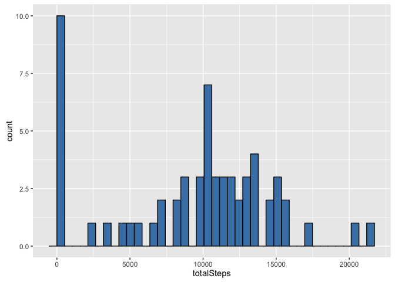

# Reproducible Research: Peer Assessment 1


## Loading and preprocessing the data

```r
library(dplyr)
```

```
## 
## Attaching package: 'dplyr'
```

```
## The following objects are masked from 'package:stats':
## 
##     filter, lag
```

```
## The following objects are masked from 'package:base':
## 
##     intersect, setdiff, setequal, union
```

```r
library(ggplot2)
library(lubridate)

# Parameters for reading and ploting the data
activityInputFileName <- "activity.csv"

print(paste("Reading file:", activityInputFileName, sep = " "))
```

```
## [1] "Reading file: activity.csv"
```

```r
if(!file.exists(activityInputFileName))
{
  print(paste("Input file", activityInputFileName, "does not exist in working directory: ", getwd(), sep = " "))
  print("Please check...")
  stop()
}


# Reading input file
inputData <- read.csv( activityInputFileName, header = TRUE, 
                       sep = ",", na.strings = "NA")
```

## What is mean total number of steps taken per day?

```r
point1 <-
  inputData %>%
  group_by(date) %>%
  summarize(totalSteps = sum(steps, na.rm = TRUE),
            dataMean = mean(steps, na.rm = TRUE),
            dataMedian = median(steps, na.rm = TRUE)) %>%
  arrange(date)

# Plot the histogram of the total number of steps taken each day
p1_1 <-
  ggplot ( data = point1, aes(totalSteps) ) +
  geom_histogram( bins = 40, col = "black", fill = "steelblue" )
print(p1_1)
```




## What is the average daily activity pattern?


## Imputing missing values


## Are there differences in activity patterns between weekdays and weekends?
