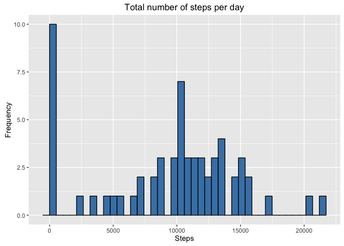
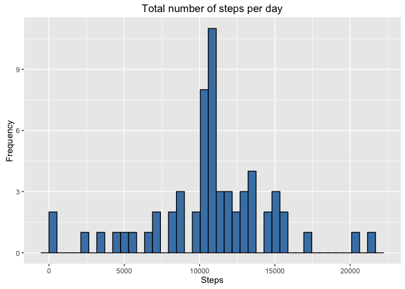

# Reproducible Research: Peer Assessment 1


## Loading and preprocessing the data

```r
library(dplyr)
```

```
## 
## Attaching package: 'dplyr'
```

```
## The following objects are masked from 'package:stats':
## 
##     filter, lag
```

```
## The following objects are masked from 'package:base':
## 
##     intersect, setdiff, setequal, union
```

```r
library(ggplot2)
library(lubridate)
library(chron)
```

```
## 
## Attaching package: 'chron'
```

```
## The following objects are masked from 'package:lubridate':
## 
##     days, hours, minutes, seconds, years
```

```r
# Parameters for reading and ploting the data
activityInputFileName <- "activity.csv"

print(paste("Reading file:", activityInputFileName, sep = " "))
```

```
## [1] "Reading file: activity.csv"
```

```r
if(!file.exists(activityInputFileName))
{
  print(paste("Input file", activityInputFileName, "does not exist in working directory: ", getwd(), sep = " "))
  print("Please check...")
  stop()
}


# Reading input file
inputData <- read.csv( activityInputFileName, header = TRUE, 
                       sep = ",", na.strings = "NA")
```

## What is mean total number of steps taken per day?

```r
# With dplyr get the total, mean and median of steps by date
point1 <-
  inputData %>%
  group_by(date) %>%
  summarize(totalSteps = sum(steps, na.rm = TRUE),
            dataMean = mean(steps, na.rm = TRUE),
            dataMedian = median(steps, na.rm = TRUE)) %>%
  arrange(date)

p1_1 <-
  ggplot ( data = point1, aes(totalSteps) ) +
  geom_histogram( bins = 40, col = "black", fill = "steelblue" ) +
  labs(x = "Steps") +  
  labs(y = "Frequency") +
  labs(title = "Total number of steps per day") 
print(p1_1)
```



```r
p1_2 <-
  ggplot( data = point1, aes(x = date, y = dataMean, group = 1) ) +
  geom_line(col="steelblue") + 
  geom_point() + 
  theme(axis.text.x = element_text(angle = 90, hjust = 1)) +
  labs(x = "Day") +  
  labs(y = "Mean of number of steps") +
  labs(title = "Mean number of steps per day") 
print(p1_2)
```

```
## Warning: Removed 2 rows containing missing values (geom_path).
```

```
## Warning: Removed 8 rows containing missing values (geom_point).
```


```r
p1_3 <-
  ggplot( data = inputData, aes(x = factor(date), y = steps)) +
  geom_boxplot() +
  scale_y_log10() +
  theme(axis.text.x = element_text(angle = 90, hjust = 1)) +
  labs(x = "Day") +  
  labs(y = "Median of number of steps") +
  labs(title = "Median of number of steps per day") 
print(p1_3)
```

```
## Warning: Removed 13318 rows containing non-finite values (stat_boxplot).
```


## What is the average daily activity pattern?

```r
avgDayActDF <-
  inputData %>%
  select(interval, steps) %>%
  group_by(interval) %>%
  summarize(dataMean = mean(steps, na.rm = TRUE)) %>%
  arrange(interval)

avgDayActPlot <- 
  ggplot ( data = avgDayActDF, aes(x = interval, y = dataMean) ) +
  geom_line() +
  labs(x = "Time interval") +  
  labs(y = "Mean of number of steps") +
  labs(title = "Mean of number of steps per time interval") 
print(avgDayActPlot)
```


```r
avgMaxNumSteps <-
  avgDayActDF %>%
  select(interval, dataMean) %>%
  filter(dataMean == max(dataMean, na.rm = TRUE))

print(avgMaxNumSteps)
```

```
## Source: local data frame [1 x 2]
## 
##   interval dataMean
##      (int)    (dbl)
## 1      835 206.1698
```

## Imputing missing values

```r
print("Number of rows with NA")
```

```
## [1] "Number of rows with NA"
```

```r
table(is.na(inputData$steps))[2]
```

```
## TRUE 
## 2304
```

```r
totalMean = mean(inputData$steps, na.rm = TRUE)

print("Replacing NA values")
```

```
## [1] "Replacing NA values"
```

```r
notNAData <-
  inputData %>%
  mutate(steps = ifelse(is.na(steps), yes = totalMean, no = steps))

print("Calculating sum, mean and median of new dataset")
```

```
## [1] "Calculating sum, mean and median of new dataset"
```

```r
point3 <-
  notNAData %>%
  group_by(date) %>%
  summarize(totalSteps = sum(steps, na.rm = TRUE),
            dataMean = mean(steps, na.rm = TRUE),
            dataMedian = median(steps, na.rm = TRUE)) %>%
  arrange(date)

print("Ploting new histogram")
```

```
## [1] "Ploting new histogram"
```

```r
p3_1 <-
  ggplot ( data = point3, aes(totalSteps) ) +
  geom_histogram( bins = 40, col = "black", fill = "steelblue" ) +
  labs(x = "Steps") +  
  labs(y = "Frequency") +
  labs(title = "Total number of steps per day") 
print(p3_1)
```



```r
print("Ploting new mean")
```

```
## [1] "Ploting new mean"
```

```r
p3_2 <-
  ggplot( data = point3, aes(x = date, y = dataMean, group = 1) ) +
  geom_line(col="steelblue") + 
  geom_point() + 
  theme(axis.text.x = element_text(angle = 90, hjust = 1)) +
  labs(x = "Day") +  
  labs(y = "Mean of number of steps") +
  labs(title = "Mean number of steps per day") 
print(p3_2)
```


```r
print("Ploting new median")
```

```
## [1] "Ploting new median"
```

```r
p3_3 <-
  ggplot( data = notNAData, aes(x = factor(date), y = steps)) +
  geom_boxplot() +
  scale_y_log10() +
  theme(axis.text.x = element_text(angle = 90, hjust = 1)) +
  labs(x = "Day") +  
  labs(y = "Median of number of steps") +
  labs(title = "Median of number of steps per day") 
print(p3_3)
```

```
## Warning: Removed 11014 rows containing non-finite values (stat_boxplot).
```


* The histogram, the mean and median differ from previous plots.

## Are there differences in activity patterns between weekdays and weekends?

```r
newInputData <-
  inputData %>%
  mutate(isWeekend = factor(is.weekend(ymd(date)), labels=c("WEEKDAY", "WEEKEND"))  ) %>%
  group_by(interval, isWeekend) %>%
  summarize(meanSteps = mean(steps, na.rm = TRUE))

weekdayPlot <-
  ggplot ( data = newInputData, aes(x = interval, y = meanSteps) ) +
  geom_line(col="steelblue") +
  facet_grid(isWeekend ~ .) +
  labs(x = "Time interval") +  
  labs(y = "Mean of number of steps") +
  labs(title = "Comparisson of the mean of number of steps per time interval during weekends and weekdays") 
print(weekdayPlot)
```


